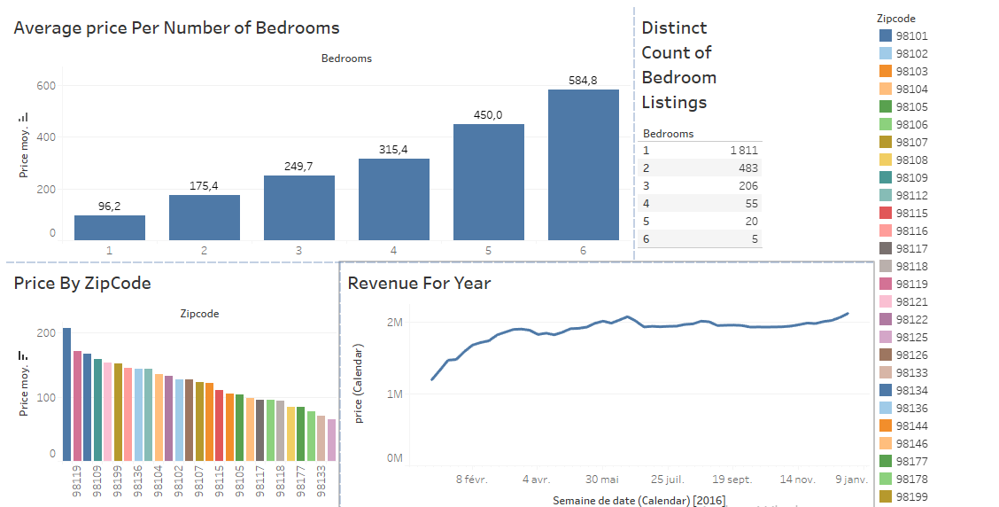

# AirBnB Data Visualization with Tableau : Project Overview

It's a pure Tableau full project created to make a dashboard out of an AirBnB dataset. This dashboard consists of four charts :
* The first plot describes the average price of houses to be rented out for customers according to their number of bedrooms.
* The second figure shows us a distinct count of houses presented into our data taking into consideration how many bedrooms they own.
* The third picture declares the variation of houses average price per zip code in the United States of America (exactly in Seattle city).
* The fourth and last chart is used to emphasize the importance of AirBnB revenue in the year of 2016.

  

